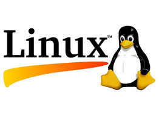

# Open Source World

## Licenses

* Open Licenses or Copyright?
* Why open Licences?
* CC Licenses

## Open Source

  * What is open-source?
  * Only for code?
  * What can I do with open Tools?
  * Only for small projects?
	  * Linux
    * 3D Printers

  * We teach to the children  that ...
      * They can control the tools
      * Using pirate software is not legal

  * They are free
  * Low costs
  * Invert the money in what it really worth

# Projects open-source

## Linux

80% of Internet's server uses Linux or free software

* Apache Web server

* [History](https://en.wikipedia.org/wiki/History_of_Linux):
  * In 1991, [Linus Torvalds](https://en.wikipedia.org/wiki/Linus_Torvalds) starts some tests
  * Now more than 18.000.000 lines of

## Raspberry:

  * Low cost (25$) computer that every child can use at home & school.
  * It has not cover in order to fire the curiosity
  * Several millions have been sold...

## [Arduino](http://arduino.cc)

What is arduino?

## [Micro micro:Bit](http://www.eldiario.es/turing/BBC_micro-bit-utilizaran-escolares-Reino-Unido_0_411209780.html)

Next years every child between 11 and 12 will get one

* Easy to program
* Teach Electronics
* Can grow

[Vídeo](https://www.youtube.com/watch?time_continue=6&v=Wuza5WXiMkc)

## [One Laptop Per Child (OLPC)](http://one.laptop.org/)

* No need of electricity (hand crank)
* Robust
