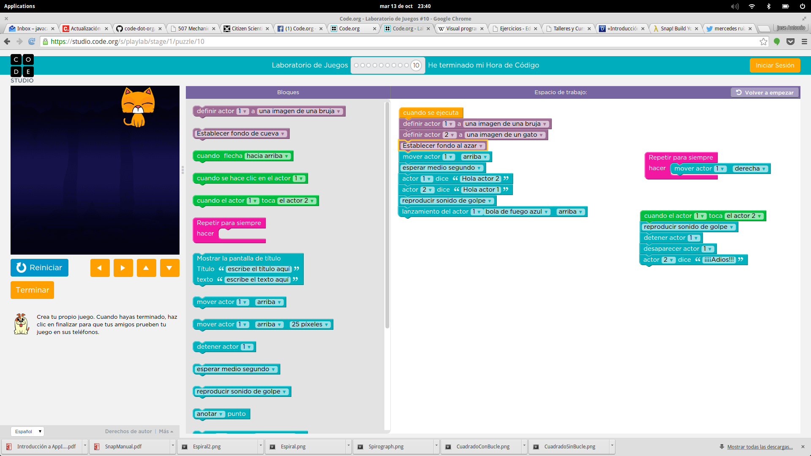
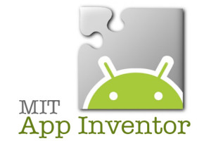
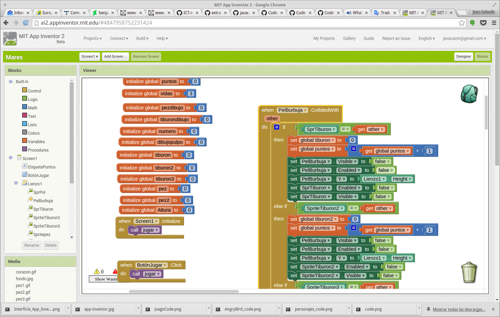

# Programming in class

##  What is programing?

## Are you sure that I can program?

## Do you know how to program?

## Have you ever program anything?

## Why programming?
* Programming benefits
	* Thinking
	* Taught how to solve problems
	* Analytical capacity
	* Concentration

## Is it only a trend?

##  Ok, let's do it

* What do we need?
* Where do it?

# Let's start!!

## [code.org](http://code.org)

##  Why is not a .com?
## who is behind?

## Let's make small programs to help our friends

## Do you prefer Frozen? Angry birds? Flappy bird? Star wars?

## Several levels

### [level 1](https://studio.code.org/hoc/1/)

### Games

### Let's see something more complex

[game code.org](https://studio.code.org/s/playlab/stage/1/puzzle/10)

### More complicated applications: snap

[Scratch](http://snap.berkeley.edu/snapsource/snap.html)

### Android

[App Inventor](http://ai2.appinventor.mit.edu/#4847958752231424)

## Much powerful that it looks at first sight

## Practical examples

* Teaching Math: Polygons
* Teaching History: "Neil Armstrong arrived to the Moon" or "Colon in front of Catholic Kings"
