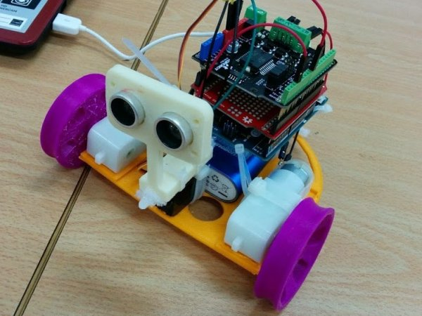
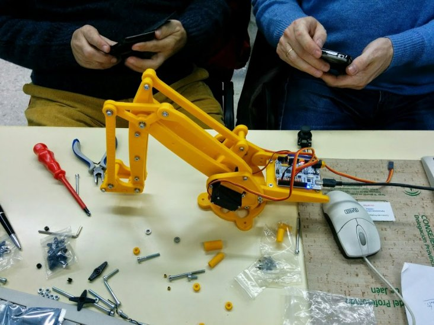
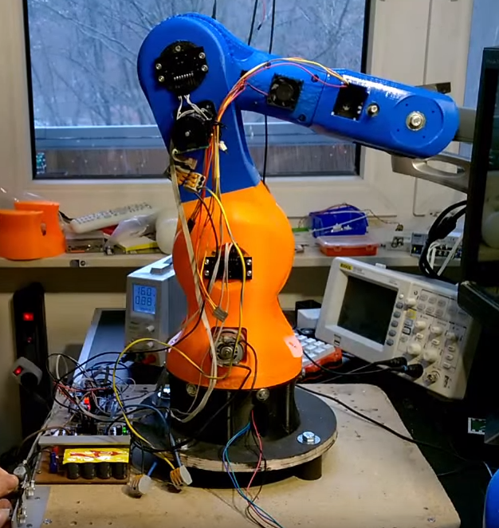
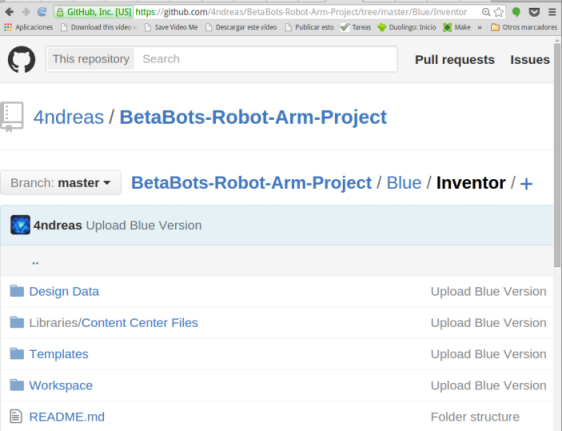
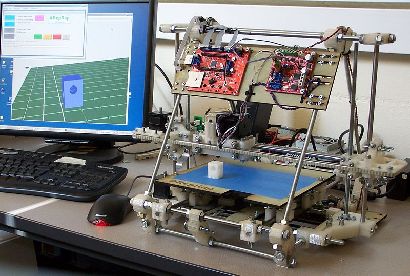
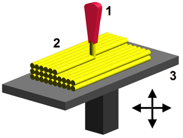
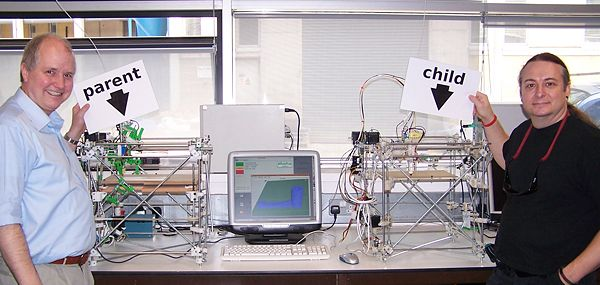
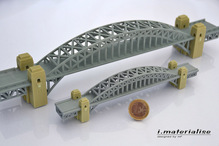
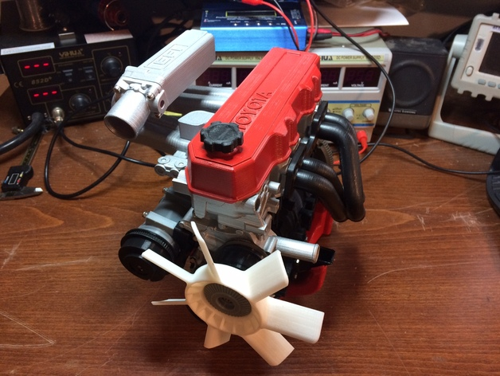
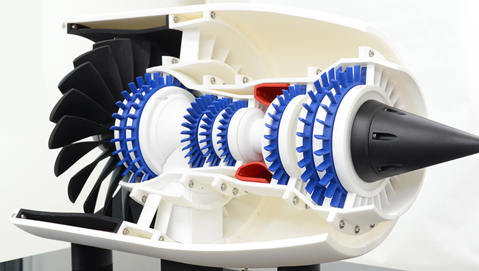

# Teaching to make

* Making things
  * Programming (Physical Computing)
  * Electronics
  * 3D Designing
  * 3D Printing

### "Open" is diverse

### "Open" is so diverse ...

### "Open" is so diverse  that it has several logos...

### You can find small projects

### ... bigger projects

### Even ... AWESOME projects!!!

###  And everything is open, free!!!

### You can make it, test it, improve it!

### Where can we find those projects?

* [Instructables](http://instructables.com)
* [MakeZine](http://makezine.com)
* [HackaDay](http://hackaday.com)
* [github](https://github.com) (almost all [my courses' docs](https://github.com/javacasm))

# Physical Computing

Building interactive physical systems using our own software

  * Creating things that move an make what we want:  Robots

* Making things (Physical Computing)

  * Programming: Scratch, blockly
  * Electronics: Using modular Electronics
  * 3D Designing: Freecad
  * 3D Printing: Reprap

  ## 3DPrinting

  

Using:
  * Arduino
  * Freecad
  * Open Hardware [RepRap](http://reprap.org/)

  How does 3d Printing work?

RepRap Movement: [Adrian Bowyer](http://en.wikipedia.org/wiki/Adrian_Bowyer) invented [Machine Self-Replication](http://reprap.org/wiki/About#Machine_Self-Replication)

## Some Models:

* Architects

## Engineers

([Engines](https://github.com/gNSortino/OSREngines))

[Model](https://www.thingiverse.com/thing:392115)

#### Repositories

* [youimagine](https://www.youmagine.com)
* [Thingiverse](http://www.thingiverse.com)
* [yeggi](http://www.yeggi.com/)
* [MyMiniFactory](https://www.myminifactory.com/)
* [GrabCad](https://grabcad.com/)
